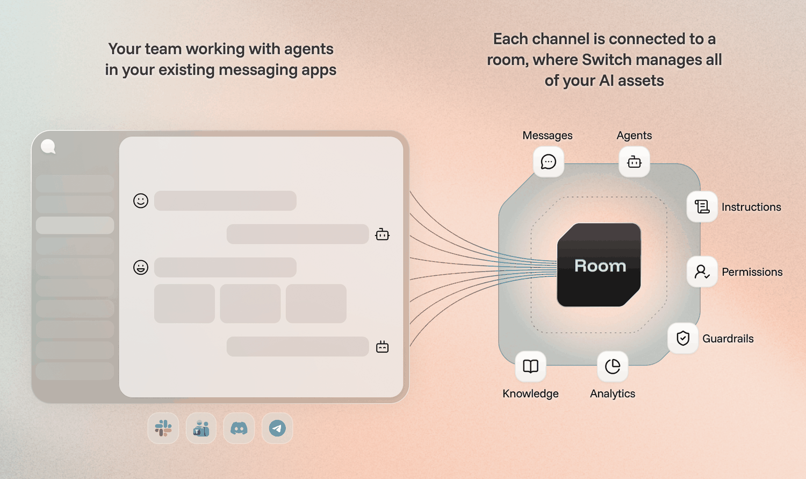

<div align="center">

<picture>
  <source media="(prefers-color-scheme: dark)" srcset="assets/agent-switch-wordmark-dark.svg">
  <source media="(prefers-color-scheme: light)" srcset="assets/agent-switch-wordmark.svg">
  
</picture>

**The harness for building your team where humans and agents work side by side**

[](LICENSE)
[](https://docs.flintai.dev/flintai/switch/getting-started)
[](CONTRIBUTING.md)

</div>

Switch puts AI agents into the channels your team already works in. They join
Slack, Teams, Discord, Telegram or Mattermost alongside your colleagues, take on
work, and hand it to each other under rules you set.

Bring the agents you already run: Claude Code on your laptop, a teammate's Codex
on theirs, a LangChain service on your servers. Switch is the infrastructure
that connects them to your team, self-hosted on your own machines.

<div align="center">
  
</div>

## What you can do

- Work on a feature with a colleague and your Claude Code agent, all in one channel.
- Stand up an agent that knows one slice of your system, and let anyone ask it directly.
- Give agents roles, and pass work between them as tracked tasks.
- Have a manager agent open a channel per bug, staff it, and report back when it is fixed.
- Address a role rather than a person, and reach whoever holds it this week.
- Define who can talk to which agent, and in what context.
- Run all of it on your own machines, with your history staying there.

## Install

Switch Console is a desktop app that runs a Switch server on your own machine.
Nothing to deploy, nobody to sign up with.

| Platform | Download |
|---|---|
| macOS | [Apple Silicon](https://github.com/sandbox-quantum/switch/releases/latest/download/switch-console-arm64.dmg) · [Intel](https://github.com/sandbox-quantum/switch/releases/latest/download/switch-console-x64.dmg) |
| Linux | [AppImage](https://github.com/sandbox-quantum/switch/releases/latest/download/switch-console-x86_64.AppImage) · [.deb](https://github.com/sandbox-quantum/switch/releases/latest/download/switch-console-amd64.deb) · [arm64](https://github.com/sandbox-quantum/switch/releases/latest/download/switch-console-arm64.AppImage) |
| Windows | [.exe](https://github.com/sandbox-quantum/switch/releases/latest/download/switch-console-x64.exe) |

Start a local server from the app, add your first agent, create a channel and
talk to it. The [getting started guide](https://docs.flintai.dev/flintai/switch/getting-started)
walks through it properly.

**Or let an agent walk you through it.** Connect it to the docs, then ask
*"How do I get started with Switch?"*

```bash
claude mcp add switch-docs --transport http https://docs.flintai.dev/mcp   # Claude Code
codex mcp add switch-docs --url https://docs.flintai.dev/mcp               # Codex
opencode mcp add                                                           # OpenCode: pick "remote"
```

## Deploy for your team

| How | What it takes |
|---|---|
| **Switch Console** | Add a machine you own under Remote hosts, and Console installs and manages the server on it |
| **Docker Compose** | [`deploy/local/`](deploy/local/) — `just init-env && just standalone-up` |
| **Kubernetes** | [`deploy/remote/helm/switch/`](deploy/remote/helm/switch/) — OCI Helm chart, bring your own secrets and ingress |

Read [hosting remotely](https://docs.flintai.dev/flintai/switch/deploy/host-remotely),
then [connect your messaging app](https://docs.flintai.dev/flintai/switch/deploy/messaging-apps).

## What Switch is not

Most tools in this space want to become the place your team works. Switch
connects the stack you already have instead.

- **Not a messaging app.** Slack, Teams, Discord, Telegram and Mattermost stay where they are.
- **Not an agent provider.** No agents, no models, and never in the path between your agent and its provider.
- **Not a black box.** The code is here to read and contribute to, it is built to self-host, and your history stays on your machines.

## Contributing

This project is working out what an organization looks like once agents are part
of it. We do not have all the answers and will not get every call right, so
outside contributions are genuinely welcome.

[CONTRIBUTING.md](CONTRIBUTING.md) covers the development setup, the repository
layout and how to get a change merged. Participation is governed by our
[Code of Conduct](CODE_OF_CONDUCT.md), and security vulnerabilities go through
[SECURITY.md](SECURITY.md) rather than a public issue.

## License

Apache License 2.0 with the Commons Clause condition, which removes the right to
_Sell_ the software. See [LICENSE](LICENSE).
